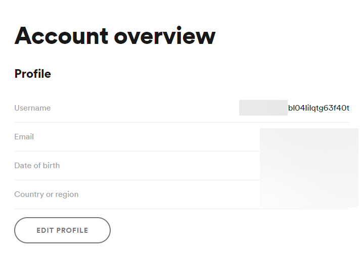
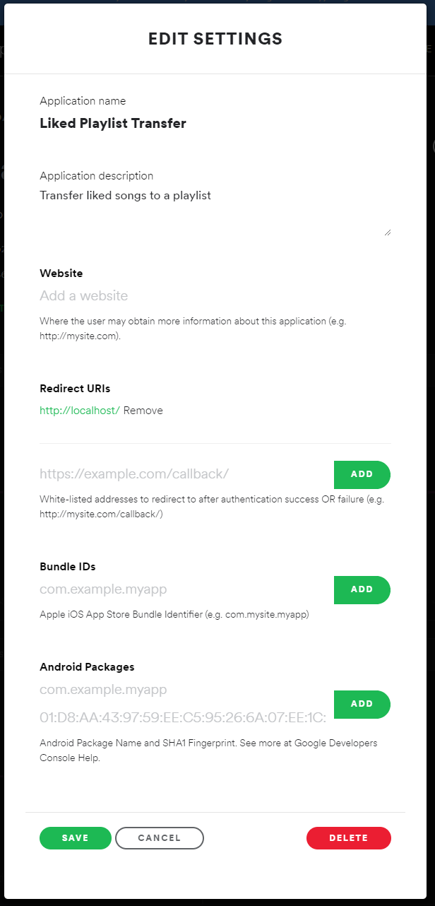

## Spotify Liked Transfer

Automatically transfers liked songs to a `Liked` playlist.

This was created out of frustration with:

- https://community.spotify.com/t5/Desktop-Windows/Windows-10-Can-t-select-large-amounts-of-tracks-in-Liked-Songs/td-p/4855451
- https://community.spotify.com/t5/Desktop-Mac/Can-t-select-multiple-songs-to-add-to-playlist/td-p/557186
- https://www.reddit.com/r/spotify/comments/e7fr42/somebody_tell_me_why_i_cant_select_all_songs_from/

### Usage

1. Rename `.env.example` to `.env`
2. Edit `.env`
   1. `USER_ID` can be obtained on your profile, under the username section usually 
   2. `CLIENT_ID` and `CLIENT_SECRET` requires you to register a developer application at https://developer.spotify.com/dashboard/applications
      1. In addition to copying `CLIENT_ID` and `CLIENT_SECRET` after creating the application, you need to ensure to add `http://localhost/` as a redirect URL 
3. After filling out `.env`, execute the binary (.exe, etc) using the command line in the same directory as the `.env` file
   1. Pre-compiled binaries are available on the Github release page
4. The application will open your browser and ask you to authenticate through Spotify
5. Copy the *full* URL you are redirected to (`http://localhost/...`) and paste it into the application to complete the authorization
6. The application will start moving your liked songs to a playlist under `Liked`
